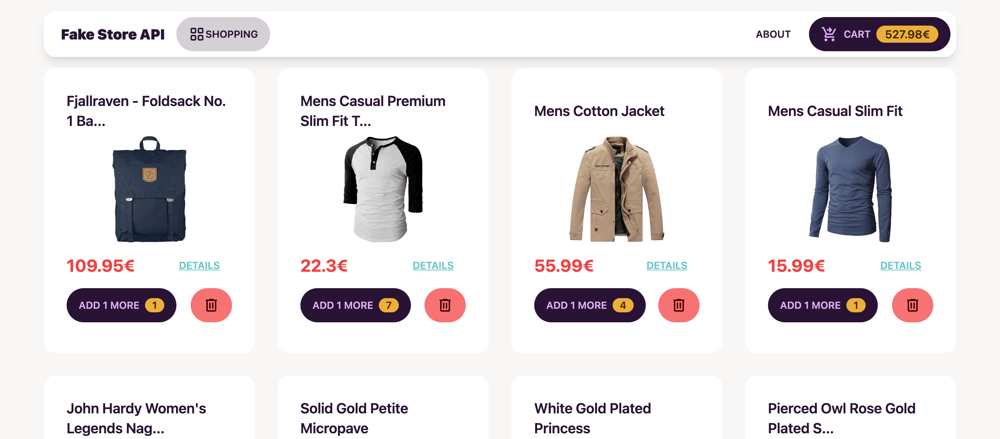

# vite-vue-project-fake-store



* Pinia (Vue 3 state management)
* TailwindCSS (CSS framework)
* DaisyUI (TailwindCSS components)
* Vue Router (Vue 3 router)

This example should help get you started developing with Vue 3 in Vite.

## Project Setup

```sh
npm install
```

### Compile and Hot-Reload for Development

```sh
npm run dev
```

### Compile and Minify for Production

```sh
npm run build
```

### Lint with [ESLint](https://eslint.org/)

```sh
npm run lint
```
